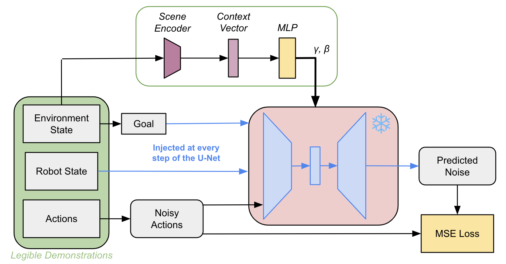
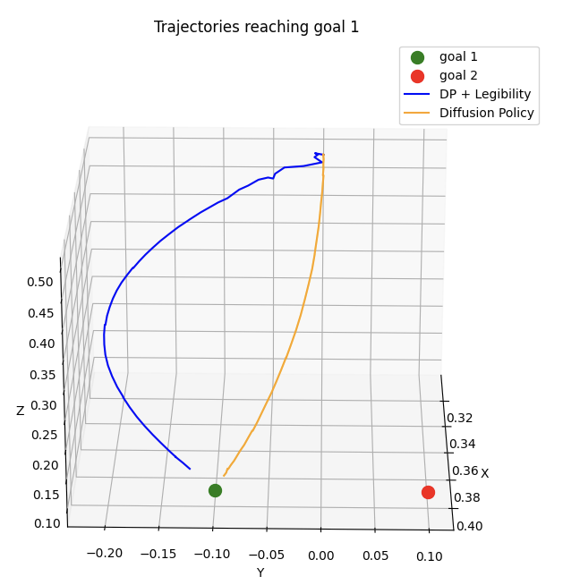

# Encoding Legibility for Style Conditioned Diffusion Policy

Adrien Jacquet Crétides 



Architecture based on Diffusion Policy: https://diffusion-policy.cs.columbia.edu/

We're using a goal-conditioned Diffusion Policy, predicting the next actions based on the robot's current state and the goal coordinates. A Franka Emika robot was used to record the data and train the different available checkpoints.

## Software and dependancies (tested)

* Ubuntu 20.04.3
* diffusers 0.18.2
* torch 2.4.1
* panda-python 0.8.1
* tqdm 4.67.1
* numpy 1.21.5
* matplotlib 3.7.5
* pickle
* h5py
* math

## Training

You can train every part of the architecture from scratch. Alternatively, you can start from the pre-trained Diffusion Policy model and train the legibility MLP using it, or use already trained checkpoints to infer directly.

Training datasets can be downloaded at : https://drive.google.com/file/d/1TN0AmUU9rrV9mv_jFxMzRuWXSL-z26VG/view?usp=drive_link.
After downloading them, training datasets can be placed in the `data/` folder.

First, train base Diffusion Policy model on hdf5 dataset :
```console
$ python train_policy.py
```

Then train the scene encoder :
```console
$ python train_scene_encoder.py
```

Finally, train the legibility MLP on hdf5 legible dataset, using the previously trained Diffusion Policy model and scene encoder :
```console
$ python train_legibility_mlp.py
```

Checkpoints created will be stored in the `output/` folder. Change the checkpoints' names or the data used for training by modifying the training scripts.

Pre-trained Diffusion Policy checkpoint can be downloaded at : https://drive.google.com/file/d/1QPx6FVZVLaSRC14mWA61qw8zrYspkFBR/view?usp=sharing. You can then place it in `output/ckpt/`.
Pre-trained scene encoder and legibility MLP checkpoints can be found respectively in `output/scene_encoder/` and `output/mlp/`.

`dp_25000.ckpt` was trained on `15000_nlegible.hdf5` and `10000_legible.hdf5` for 100 epochs. `se_20000_50e.pth` was trained on 20000 randomnly positionned pairs of goals for 50 epochs. Using `dp_25000.ckpt` and `se_20000_50e.pth`, `legibility_100e.pth` was trained on `.hdf5` for 100 epochs.

Diffusion Policy checkpoints are trained on a "nlegible" hdf5 file, containing diverse demonstrations, and on a "legible" hdf5 file, containing only legible demonstrations. Legibility MLP checkpoints are only trained on the "legible" hdf5 file.

## Inference



Generate trajectories to reach a goal g* in a legible way, depending on an opposing goal g- :
```console
$ python inference_example.py
```